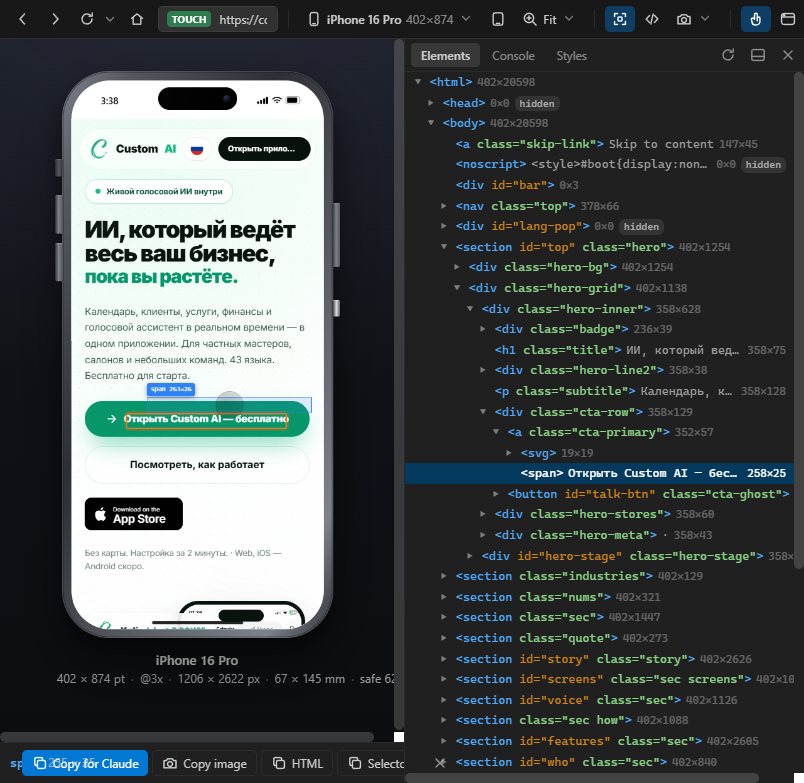
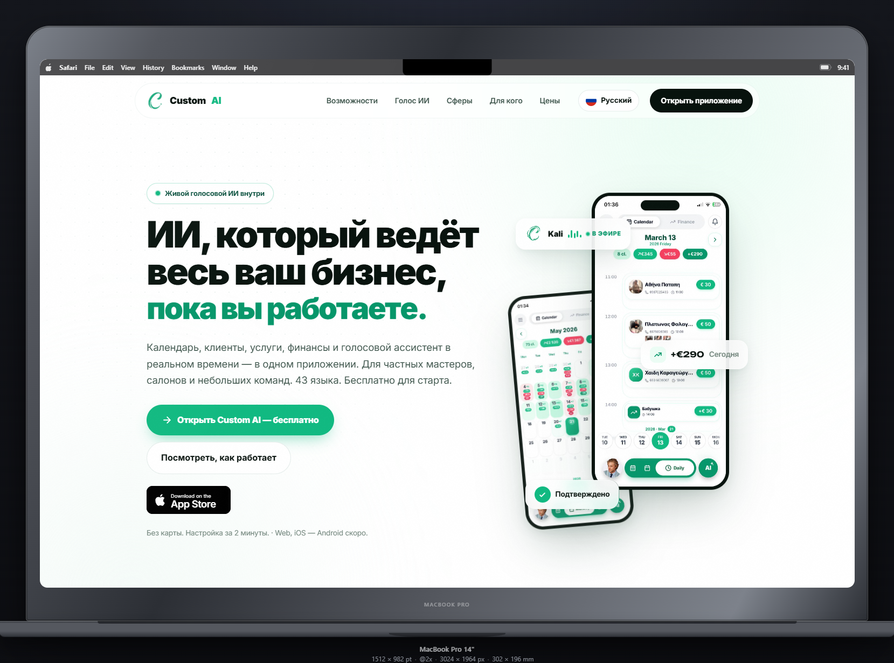
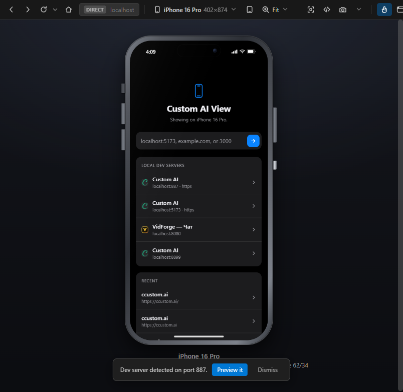
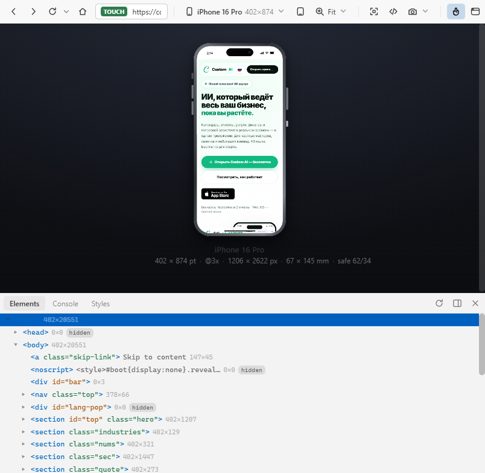

# Custom AI View

**A real browser inside pixel-accurate device frames — that an AI agent can drive and
see.** iPhone, iPad, Android, MacBook. Ships as a Windows app and as a VS Code
extension, with an MCP server so Claude looks at the same window you do.

[ccustom.ai/view](https://ccustom.ai/view) · by [Custom AI](https://ccustom.ai)



---

## Why this exists

Chrome's device toolbar resizes a viewport. It does not give you a phone, and it does
not give an agent anything to look at.

Custom AI View does three things nothing free does together:

- **It photographs the window you are actually looking at** — your login session, your
  scroll position, your unsaved input — and hands the picture to an AI agent over MCP.
  Not a re-render in a clean profile: the screen you can see.
- **It shows sites that refuse to be framed.** A local reverse proxy strips
  `X-Frame-Options` and CSP, rewrites `@media (hover)` and `env(safe-area-inset-*)`,
  renames `__Host-` cookies so logins survive, and terminates the self-signed TLS your
  dev server uses.
- **It is physically true.** Bodies, screens and corner radii come from published
  dimensions in millimetres; bezels are derived from body-minus-panel. *Actual size
  1:1* measures your monitor over EDID and draws the device at life size — hold a real
  iPhone against the glass and it matches.

## What an agent can do with it

```
custom_ai_view_open        open a URL on a given device
custom_ai_view_wait        wait for an element, or for loading to finish
custom_ai_view_screenshot  the live window — and it says so when it is not
custom_ai_view_find        elements by selector or visible text, with real visibility
custom_ai_view_click       tap · _type  type, optionally submitting on Enter
custom_ai_view_key         Enter, Escape, Tab, arrows
custom_ai_view_scroll      the page, or one scroller inside it
custom_ai_view_inspect     markup, computed styles, box, ancestry
custom_ai_view_tree        walk the DOM a level at a time
custom_ai_view_edit        change the live page; survives reload; revert undoes it
custom_ai_view_console     page output *and* the browser's own messages, with ages
custom_ai_view_back        go back without losing SPA state
custom_ai_view_record      screen recording with no fixed length
custom_ai_view_collect     screenshot + markup + console + selection, in one folder
```

Every tool takes a `window` argument, so a phone and an iPad can be driven side by
side.

## Install

**Windows app** — download `CustomAIView.exe` from
[Releases](https://github.com/amugusus/custom-ai-view/releases), run it, and pin it.
No dependencies; it needs Chrome or Edge installed. To put the branded shortcut on
your desktop: `node scripts/make-launcher.js`.

**VS Code extension** — download the `.vsix` from Releases and
`code --install-extension custom-ai-view-<version>.vsix`, then reload the window.

**For Claude Code**

```
claude mcp add custom-ai-view --scope user -- node <path>/mcp/server.js
```

The MCP server starts the app itself if it is not running, so an agent never has to
ask a human to open something first.

## Build from source

```
node scripts/build-exe.js       # dist/CustomAIView.exe  (Node SEA, ~82 MB)
node scripts/make-launcher.js   # desktop shortcut with the icon
npm run package                 # the .vsix
```

macOS and Linux build the same way; the launcher and browser registration are Windows
only.



## What it looks like

| | |
|---|---|
|  |  |
| Dev servers are found by asking the OS what is listening, then asking each one whether it serves pages — with its title and icon | Light, dark, or follow the system |

## Notable details

- **The home indicator floats over the page**, as on a real phone — nothing is carved
  out of the viewport. `env(safe-area-inset-bottom)` still reports 34.
- **A finger, not an arrow.** On phones and tablets the cursor is a 44 px circle: the
  contact patch a fingertip actually covers, which is what decides whether a control
  is reachable.
- **Momentum matches iOS** (0.967 per frame), horizontal strips drag, and text does not
  select while you swipe.
- **Captures are filed by site** under *Desktop → Custom AI View*, with `screenshots/`,
  `recordings/`, `logs/` and `code/`, plus a one-button "save everything about this
  page".
- **When a page leaves for another app** — `itms-appss://` and friends — the frame says
  so instead of going white.

## Licence

Proprietary. See [LICENSE](LICENSE). You may use it; you may not redistribute it,
fork it, rebrand it, or present any part of it as your own. "Custom AI",
"Custom AI View" and the C mark are trademarks of Custom AI.

For permission: contact@ccustom.ai

---

Read this in [Russian](README.ru.md) · © 2026 Custom AI · https://ccustom.ai
